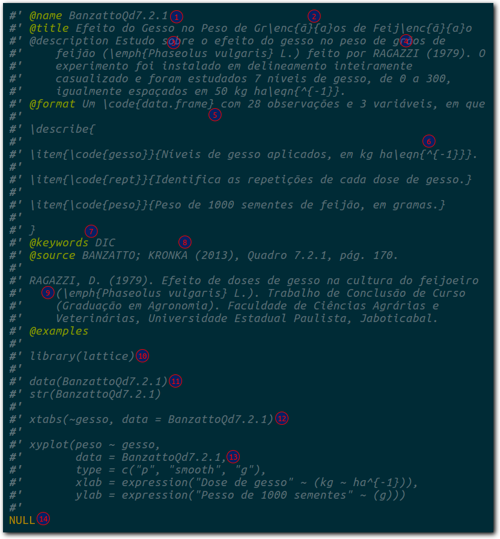

```{r setup, include=FALSE}
source("config/_setup.R")
```

O Guia de Contribuição e Estilo serve para orientar a forma de trabalhar
que seja eficiente, padronizada, coordenada e segura e produza conteúdo
de qualidade. Este guia contém orientações de como escrever o código e
escrever a documentação.

## Estilo de Escrita de Código R

Os números circulados de vermelhos nas imagens abaixo indicam diferenças
entre os padrões de escrita de código R. Os dois fragmentos de código
fazem a mesma coisa, funcionam igualmente, porém o primeiro é o padrão
adotado no labestData.


1. Use o operador `<-` e não o operador `=` para atribuir conteúdo aos
   objetos. Deixe espaço ao redor do operador `<-`. Isso resolve a
   ambiguidade: `x<-2 ` é `x < -2` ou `x <- 2`?
2. Use espaço ao redor dos operadores matemáticos: exceto `^` e `/`,
   todos os demais tem espaços ao redor: `+ - * %% %/% %*%`. Um caso
   particular é o `-` que não tem espaço quando é o negativo (`-5 * 2`)
   mas tem quando é o menos (`2 - 5`).
3. Use espaço ao redor dos operadores lógicos:
   `== != > >= < <= & && | || %in%`.


1. Use espaço para separar o argumento do valor que ele recebe.
2. Sempre use espaço após a vírgula e nunca use antes dela.
3. A regra para a vírgula vale dentro de colchetes também. Duas vírgulas
   não ficam coladas.
4. Use aspas duplas. Usuários experientes afirmam que a dupla é mais
   visível por ser um caractere mais cheio. Na linguagem R não existe
   nenhuma diferença de função entre elas, para outras, como o Shell,
   existe e deixa de ser uma questão estética mas funcional.
5. Em algumas linguagens de programação há quem goste do estilo *comma
   first*. No entanto, além de não haver um argumento forte para, não é
   esse o padrão adotado pelos programadores de R. Não use *comma
   first*.


1. Acostume-se a usar nomes curtos. A chance de erro de digitação com
   nomes curtos é menor. Tente abreviações e siglas para definir os seus
   objetos, evitando nomes que excedam 6 caracteres. O caso de nomes de
   função em pacote é uma exceção, pois nomes curtos demais podem não
   ser difícil de recordar ou de adivinhar o significado dele. Quando
   houver necessidade de nome composto, pode ser usado `.` e o
   `_`. Existe uma preferência para que nomes de funções em pacotes usem
   o `_` porque o `.` é usado na construção de funções método.
2. Use endereços relativos porque isso deixa o código com
   mais portabilidade.
3. Evite 1) espaço no nome de diretórios e arquivos, 2) evite caracteres
   acentuados (não ASCII) e 3) evite letras maiúsculas para diminuir os
   erros de digitação. No lugar dos espaços recomenda-se usar
   *underline* ou traço.
4. Evite ultrapassar 72 caracteres no comprimento das linhas do
   código. Isso deixa seu código mais vertical e legível, não esconde
   texto para monitores de pequena resolução, evita quebras de linhas
   acidentais quando o texto é colado em processadores de texto (me
   pergunto para que alguém faz isso[^1]) ou se e-mail.
5. Não abrevie o nome dos argumentos. Você pode até ganhar
   microssegundos de tempo com isso, mas o seu código fica menos
   portável (mais sujeito a erro e ambiguidade) além de ser menos
   compreendido por um usuário não familiar com a linguagem ou com a
   função que você está usando.
6. Nunca abrevie para `T` ou `F` os valores lógicos `TRUE` e `FALSE`. Os
   últimos são palavras reservadas do sistema mas os primeiros são
   apenas objetos, ou seja, nada impede de fazer `T <- 10` e isso seria
   desastroso para que abrevia `TRUE` com `T`.
7. Evite definir objetos ou nomes das variáveis em `data.frames` com
   maiúsculas. O R é *case sensitive* e as chances de erro de digitação
   são maiores.
8. Evite usar `;` e faça quebra de linha para deixar o código mais
   vertical. Ele é um operador que permite escrever duas instruções na
   mesma linha mas isso faz crescer horizontalmente, pode ultrapassar as
   margens.


1. Nas construções como `function`, `if`, `for`, `while`, etc, deixe
   espaço entre o parentese direito e chave esquerda.
2. O padrão de uso de chaves no R é o [K&R] 1TBS (*the one true brace
   style*). Nesse padrão de chave, o construtor (`if`, `for`, `while`,
   etc) antecede a chave que abre e chave que fecha fica sozinha na
   linha (indentada com o construtor), a menos que esteja acompanhada de
   um cláusula `else`, de outra chave ou parêntese.
3. Idem ao 1 e 2.
4. Deixe espaço entre o nome do construtor e o parêntese que abre. A
   única exceção é para `function`.
5. Idem ao 4.
6. Evite deixar as construções como `function`, `if`, `for`, `while`,
   sem as chaves mesmo que o corpo seja uma linha curta. As chaves
   evitam que linhas adicionadas acidentalmente provoquem erros e
   deixa seu código mais claro.
7. Use o `return` no final das suas funções porque isso marca melhor o
   que a função retorna. Usuários não familiares agradecem.
8. A indentação padrão no R é com 4 espaços (e não com TAB). O RStudio,
   por exemplo, vem com 2 espaços por padrão. Mude isso no
   `Global Options > Code > Editing`. Os mais experientes dizem que 4
   espaços dá mais evidência da hierarquia do código.


1. Definitivamente use `library` e não `require`. Apesar do último
   parecer mais lógico por ser um verbo, `library` é que carrega um
   pacote. Se o pacote não estiver presente, a `library` retorna um
   **Error** (!) e a `require` retorna um `FALSE`.
2. O `~` é um operador como o `-`: tem espaço se existe um objeto que o
   precede, caso contrário não tem.
3. Prefira notação científica nos gráficos. Uma grande vantagem do R é
   permitir anotação matemática nos gráficos. Use sempre que possível,
   principalmente quando os gráficos vão para uma
   monografia/disertação/tese ou artigo.


1. Para seu próprio benefício, comente o seu código. Os comentários vão
   te guiar no futuro quando sua memória falhar. Encare o seus
   comentários como um texto normal e siga as regras do idioma que
   adotar usar: acentue, comece com maiúscula, termine com ponto.
2. Quando for o caso, separe o seu código em "seções temáticas". Use
   algo para destacar isso, como uma linha horizontal. No Emacs é
   bastante fácil fazer essas linhas horizontal como o mesmo
   comprimento[^2].
3. Deixe linhas em branco para separar o código. Não empilhe código que
   não seja logicamente conectado pois os espaços funcionam como o
   intervalo entre dois parágrafos de texto.
4. Use o mesmo número de caracteres para fazer comentários. Todos os
   editores de R usam um sinal de `#`, que é mais barato. Só o Emacs que
   usa dois sinais de comentários para o R, lisp e outras linguagens
   porque no Emacs o número de sinais tem função para indentação. Mas
   isso é customizável e recomenda-se que você mude para um.

## Regras para Inclusão de Conjuntos de Dados

### Regra para dar nomes aos conjuntos de dados

Para o *labestData* conter diversas obras com rápida e precisa
identificação dos conjuntos de dados, foi necessário adotar uma regra
de nomeação. A regra é bem simples. O nome é composto por 3 partes:
`ObraIndNumer`. `Obra` é a referência a obra, `Ind` é o tipo de elemento
identificador e `Num` é o número do elemento identificador. São
exemplos da aplicação dessa regra

  * ZimmermannTb10.20: Obra @zimmermann, Tabela 10.20 (capítulo 10,
    tabela 20).
  * BanzattoQd8.4.3: Obra @banzatto, Quadro 8.4.3 (capítulo
    8, seção 4, tabela 3.)
  * PaulaEx3.7.20: Obra @paula, Exercício 3.7.20 (capítulo 3, seção 7,
    exercício 20).
  * DemetrioEg7.7: Obra @demetrio, Exemplo 7.7 (capítulo 7, exemplo
    7). Para não confundir exemplo com exercício, usou-se Eg do termo
    em latin *exempli gratia*.
  * MingotiAnA1: Obra @mingoti, Anexo A1.
  * PimentelPg142: Obra @pimentel, Página 142.

A tabela abaixo resume as siglas usadas para cada tipo de referência ao
conjunto de dados dentro da obra.

| Referência | Abreviação |
|------------+------------|
| Tabela     | Tb         |
| Quadro     | Qd         |
| Exercício  | Ex         |
| Exemplo    | Eg         |
| Apêndice   | Ap         |
| Anexo      | An         |
| Página     | Pg         |

A prioridade na hora de atribuir a identificação é a seguinte: Tabela =
Quadro > Exemplo = Exercício > Apêndice = Anexo > Página. Ou seja, se a
tabela 5 faz parte do exemplo 3 que está na página 122, o nome do
dataset terá sufixo Tb5. Note que uma página pode ter mais de uma
tabela, bem como mais de um exemplo. Além do mais, diferentes edições
podem preservar com mais facilidade a numeração das tabelas do que a
localização delas nas mesmas páginas. Sendo assim, um dataset só será
identificado como sufixo Ex ou Eg se não estiver em Tabela ou Quadro
numerado e só será identificado pela página se não houver outra
alternativa.

Dados de arquivos pessoais que não foram usados em uma publicação
(artigo, trabalho de conclusão de curso, dissertação ou tese), poder ter
o nome do proprietário, do local de origem, ou outro identificador que
seja único e descritivo do conjunto de dados.

### Regra para o nome das variáveis

O nome das variáveis não deve conter acentos (ASCII pleno), não pode
iniciar com número e só admite o *underline* como não alfanumérico (mas
evite). As variáveis de nome composto e longo devem ser representadas
por siglas e as de nome simples mas longo, por abreviação. Veja a tabela
com exemplos de como dar nome para variáveis do conjunto de dados.

| Variável                   | Nome da coluna |
|----------------------------+----------------|
| Dias                       | dias           |
| Peso                       | peso           |
| Idade                      | idade          |
| Renda                      | renda          |
| Escolaridade               | escol          |
| Cultivar                   | cult           |
| Variedade                  | varied         |
| Adubação                   | adub           |
| Produtividade              | prod           |
| Temperatura                | temp           |
| Pressão sanguínea          | ps             |
| Matéria orgânica           | mo             |
| Teor de magnésio do solo   | mg             |
| Diâmetro à altura do peito | dap            |
| Massa seca de parte aérea  | mspa           |

### Tipo de valor das variáveis

É fundamental que os objetos que armazenem as variáveis declarem o tipo
correto de valor. São 5 os tipos principais:

  * `numeric`: é o tipo de valor para variáveis contínuas. Normalmente
    essas variáveis tem unidade de medida e números decimais (e.g. 1.85
    m, 78.5 kg).
  * `integer`: é o tipo de valor para variáveis discretas (números
    inteiros). Variáveis de contagem são desse tipo. São também as
    variáveis que identificam a repetição ou amostra, normalmente
    sequências de incremento 1 que começam em 1 ou 0. Quando variáveis
    contínuas tiverem representação que não tenha casas decimais, elas
    dever ser declaradas como `integer` para salvar espaço em disco e
    tornar as contas mais rápidas.
  * `factor`: é tipo de valor para variáveis categóricas. São rótulos
    que classificam um conjunto de indivíduos/observações com uma
    variável qualitativa comum. Como exemplo, tem-se os blocos de um
    experimento em delineamento de blocos casualizados, as observações
    do mesmo bairro, os pacientes do mesmo sexo, as parcelas do mesmo
    local ou extrato, etc.
      * Os fatores devem ter o rótulo mais descritivo possível, ou seja,
        se os níveis são Kennebec, Huinkul e Buena Vista (variedades de
        batatinha) não codifique como 1, 2 e 3. Também não abrevie
        porque na forma abreviada a correspondência não é
        imediata. Quando os nomes completos são usados, eles aparecem
        nos gráficos e nas saídas, o que é bom.
      * Variáveis como sexo (Masculino, Feminino) podem ser abreviadas
        por M e F, sem prejuízo ao entendimento, pois a correspondência
        é imediata (é fácil adivinhar que M e F representa masculino e
        feminino). Da mesma forma, os níveis resistente e suscetível
        poder ser abreviados para R e S, e os Estados brasileiros podem
        ser representados pelas suas siglas.
      * Nos casos em que os fatores são representados por número
        inteiros mas são categóricos (como é caso dos blocos do
        experimento), deve-se usar `factor` ao invés de `integer` para a
        variável, mesmo que os rótulos continuem a ser os números
        inteiros. Isso evita erros na interpretação e análise dos
        dados. Uma opção para os blocos, por exemplo, é usar números
        romanos, como I, II e III, ao invés de 1, 2 e 3 (use
        `as.roman(1:n)`). Para fatores como variedade, uma alternativas
        é usar letras maiúsculas, como A, B e C, ao invés dos números.
      * Deve ser feita distinção entre fatores nominais (`factor`) e
        ordinais (`ordered`).
  * `character`: é o tipo de valor para identificar/descrever
    indivíduos, como o nome dos alunos em uma classe. Essas variáveis
    dificilmente representam uma característica preditiva de algo.
  * `logical`: são para variáveis que assumem dois valores (`TRUE`,
    `FALSE`). Também podem ser representados pelos valores inteiros 1
    e 0.

### Dados que não tabelas

Existem casos em que os dados não são uma tabela (várias variáveis, em
cada coluna uma variável de tipo diferente), ou seja, usar um
`data.frame` para armazená-los não é adequado. Existem três casos
principais:

  * Quando os dados são uma amostra aleatória de uma única
    variável. Nesse caso, os dados devem ser armazenados em um
    vetor. Ele deve ser um vetor nomeado no caso das observações terem
    rótulo, como o nome da cidade que corresponde ao valor (veja o dado
    `precip`).
  * Quando os dados são uma matriz, ou seja, todos os valores
    correspondem ao mesmo tipo de valor. É o caso, por exemplo, de uma
    matriz de distâncias entre cidades. Nesse caso, os dados devem ser
    armazenados como matriz (`matrix`). Pode-se atribuir nome para as
    linhas e colunas (`rownames` e `colnames`) para identificar os
    registros.
  * Quando os dados são uma amostra aleatória não independente, uma
    séria temporal. Neste caso, no R, há uma classe de objetos `ts`
    (*Time-Series*) que armazena os valores da amostra junto com a
    informação da frequência em que foi observada.

## Regras para Documentação dos Conjuntos de Dados

Os conjuntos de dados devem ter uma documentação que permita

. Existem vários campos da documentação que podem ser usados, no
entanto, somente 7 serão considerados indispensáveis. Uma lista completa
com a maioria dos campos está documentada em
<https://cran.r-project.org/web/packages/roxygen2/roxygen2.pdf>.

Para ilustrar o uso dos campos principais, abaixo tem-se a documentação
do *data.frame* `RamalhoTb4.7`. Embora os campos sejam autoexplicativos
por causa do nome, segue breve explicação.



`@name`
: É o campo com o nome do objeto que contém os dados (1).

`@title`
: É o título que representa o conjunto de dados. O título deve
  estar apropriado para o conjunto de dados fornecendo uma boa descrição
  do mesmo. O título deve estar captalizado, ou seja, iniciais
  maiúsculas, exceto para artigos e preposições. Para que os títulos
  aparecem na documentação em PDF, deve-se usar `\enc{}{}` (2) para as
  letras não ASCII, como as vogais acentuadas e o cedilha.

`@description`
: É o campo para fornecer a descrição detalhada do conjunto de dados,
  como delineamento ou plano amostral, objetivo do estudo (hipóteses ou
  teoria), pessoas/organizações envolvidas. A descrição pode conter mais
  de um parágrafo. Formatação de texto para itálico é feito com
  `\emph{}` (3), que deve ser usado no nome científico de
  espécies. Quando for mencionada alguma referência na obra (4) sobre os
  dados, esta deve ser incluída na descrição e aparecer no campo
  `@references`.

`@format`
: Campo que informa sobre a forma e conteúdo do conjunto de
  dados. Primeiramente deve ser informado o tipo de objeto e suas
  dimensões (5) e depois fazer a descrição de cada uma das variáveis. A
  descrição das variáveis deve conter nome, explicação, unidade de
  medida e tipo de valor. A unidade de medida deve ser escrita com
  notação de potência ao invés de denominadores (6).

`@keywords`
: São palavras que classificam o conjunto de dados de acordo, por
  exemplo, com o tipo de variável resposta, delineamento (7) ou análise
  recomendada (ex: DIC, DQL, contagem, proporção, ACP, RP). Elas
  aparecem no índice remissivo no manual em PDF e facilitam na hora de
  escolher dados para poder praticar.

`@source`
: Indica a fonte dos dados. Normalmente é a referência
  bibliográfica (8), a *url* do endereço de origem ou o nome
  proprietário dos dados (indivíduo, grupo ou instituição). Quando é
  mencionada outra fonte para os dados, como um artigo, dissertação ou
  tese, esta referência também precisa ser incluída (9). Para as obras
  usadas no pacote, é suficiente apenas a chamada da referência (autores
  e ano).

`@examples`
: Contém código R que faz análise exploratória dos
  dados, como gráficos (13) e tabelas (12). Os pacotes necessários para
  executar o código da sessão devem ser carregados (10), bem como os
  próprios dados (11). Depois da documentação, um `NULL` deve estar
  presente (14).

## Fluxo de Trabalho

O fluxograma abaixo resumo em linhas gerais o fluxo de trabalho do
*labestData*. O fluxo é composto de 3 partes: 1) a da esquerda resume
ações feitas no gitlab ou entre gitlab e repositório local; 2) a do meio
são ações usando o R com o pacote *devtools*; e 3) são as ações usando o
Git.


A primeira coisa é ler o Guia de Contribuição, que é este documento. Em
seguida, catalogar toda a obra criando uma
[*milestone*](https://gitlab.c3sl.ufpr.br/pet-estatistica/labestData/milestones)
para ela. Dentro da *milestone* devem ser criados *issues*. Cada *issue*
deve ter o conteúdo para uma semana de desenvolvimento.

O desenvolvimento começa com a criação de um ramo para inclusão das
contribuições. Cada *issue* no gitlab é numerado e para uma fácil
indentificação, o padrão é criar ramos autor numerados: `jhenifer33`,
`alessandra90`, `walmes160`. O ramo de desenvolvimento deve ser tirado
do ramo *baby*. Antes, no entanto, atualize o ramo *baby*.

Com o Git no ramo de desenvolvimento, o trabalho de inclusão do conjunto
de dados começa com a criação do arquivo texto `txt` no diretório
`data-raw/`. O arquivo deve ser um TSV (*tab separeted values*) com
valores separados por tabulação e a primeira linha como cabeçalho. Você
tem a opção de fazer *commits* quando convier. Carregue os dados em uma
sessão R e gere o binário `rda` no diretório `data/`. Em seguida,
carrege o pacote e experimente os dados que acabou de incluir para
eliminar qualquer eventual erro. Escreva a documentação do conjunto de
dados no diretório `R/`. Use a função `roxy_data()` definida em
<https://gitlab.c3sl.ufpr.br/snippets/46>. Por fim, gere e verifique se
a transcrição para o formato `Rd` aconteceu sem erros.

Agora que todos os arquivos foram criados (`txt`, `rda`, `R` e `Rd`), é
necessário fazer uma verificação completa no pacote. Se problemas
forem indentificados nessa fase, deve procurar fazer a correção antes de
subir. Se não houveram erros, então faça o empacotamento para gerar o
`tar.gz` do pacote. Por fim, suba para o repositório remoto no gitlab.

Na interface do gitlab, faça um *merge request* (requisição de fusão)
para o *merger* designado à você. Se o MR for aceito, ponto positivo,
você pode fechar o *issue* pois o completou e remover o ramo que já não
é mais necessário. Caso contrário, providencie as correções indicadas
pelo *merger* e, quando prontas, notifique-o novamente no mesmo MR.

O Projeto só termina quando todas as obras tiverem sido concluídas.

## Referências Bibliográficas

<!------------------------------------------- -->

[**labestData**]: https://gitlab.c3sl.ufpr.br/pet-estatistica/labestData
[^1]: Processador de texto é diferente de editor de texto. O MS Word e o LibreOffice Writer são processadores enquanto que o Emacs e o Geany são editores.
[K&R]: https://en.wikipedia.org/wiki/Indent_style#K.26R_style
[^2]: Faça `C 7 C 1 -` (ctrol+7 ctrol+1 traço) para fazer 71 traços.
